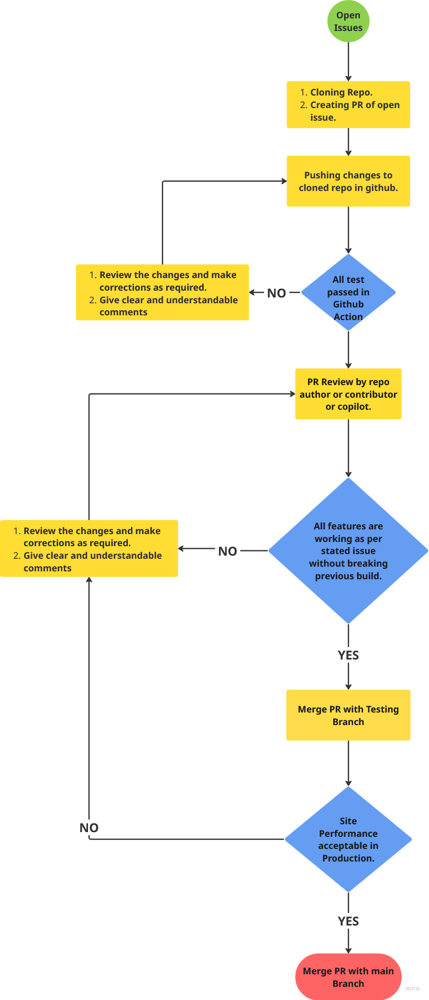
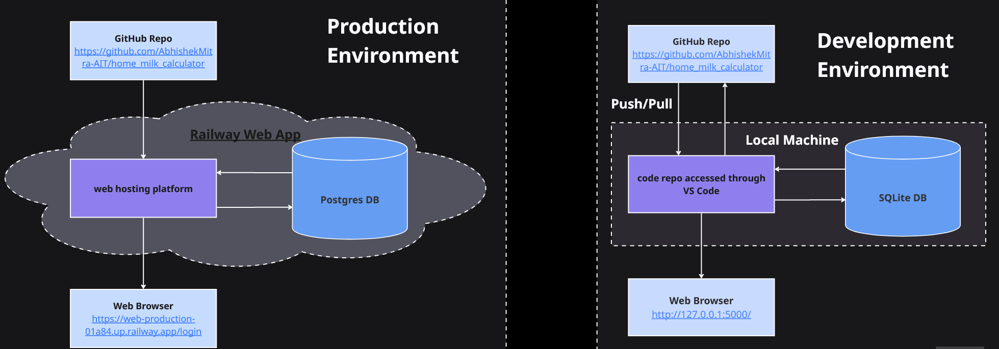

# home_milk_calculator
Daily Milk Delivery Management System - Developed a web-based solution to digitize and automate household milk delivery tracking, eliminating manual record-keeping errors.


## 🎯Key Features:

    CRUD operations for daily milk quantity entries with date management
    Automated cost calculations (₹50/liter) and monthly aggregations
    Chronological data organization with month-wise breakdowns
    Responsive UI with edit/delete functionality.

## Technical Implementation:

    Backend: Flask framework with SQLAlchemy ORM
    Database: SQLite (local) / PostgreSQL (production)
    Deployment: Railway platform with Gunicorn WSGI server
    Database migration scripts for schema updates

## 📁 Project Structure

```
# home_milk_calculator/
# ├── app.py                        # Main application entry point(at root)
# ├── app_refactored.py             # Main refactored app (at root)
# ├── assets/                       # image files
# ├── instance/                     # db files
# ├── models/
# │   ├── __init__.py
# │   └── models.py                 # Database models
# ├── supporting_python_files/      # python scripts used while testing app.py
# ├── templates/                    # html files
# │   ├── index.html
# │   ├── login.html
# │   ├── register.html
# │   ├── add.html
# │   ├── edit.html
# │   └── settings.html
# ├── utils/                        # Configuration settings
# │   ├── __init__.py
# │   └── config.py                 
# ├── views/                        # Helper functions
# │   ├── __init__.py
# │   └── helpers.py                
# ├── requirements.txt
# ├── .gitignore
# ├── Dockerfile                    
# ├── LICENCE
# ├── README.md
# ├── Procfile
# ├── sqlite_backup.sql             # postgresql backup
```

<!-- ├── src
│    └──  app.py                    # main application                                           
│    └──  migrate_database.py       # script for db migration -->

<!-- Ref using python anywhere - https://www.youtube.com/watch?v=Bx_jHawKn5A -->

- website - (https://web-production-01a84.up.railway.app/)
- Github OAuth Apps - (https://github.com/settings/developers)
- Google OAuth - (https://console.cloud.google.com/welcome?project=feisty-audio-423608-v1)

## 🚀 Installation steps for running app in local server

### Prerequisites
- Python > 3.9
- pip package manager
- Git (for cloning)

### Step 1: Clone the Repository
```bash
git clone https://github.com/AbhishekMitra-AIT/home_milk_calculator
cd home_milk_calculator
```

### Step 2: Create Virtual Environment (Recommended)
```bash
# Windows
python -m venv venv
venv\Scripts\activate

# Linux/macOS
python3 -m venv venv
source venv/bin/activate
```

### Step 3: Install Dependencies
```bash
pip install -r requirements.txt
```

### Step 4: Run the Application
```bash
python app.py
```

## 🤝 Contributing

Contributions are welcome! Please follow these steps:

1. Fork the repository
2. Create a feature branch (`git checkout -b feature/AmazingFeature`)
3. Commit your changes (`git commit -m 'Add some AmazingFeature'`)
4. Push to the branch (`git push origin feature/AmazingFeature`)
5. Open a Pull Request

Please ensure:
- Code follows PEP 8 style guidelines
- All tests pass
- Documentation is updated
- Commit messages are clear and descriptive





## 👤 Author

**Abhishek Mitra**
- GitHub: [@AbhishekMitra-AIT](https://github.com/AbhishekMitra-AIT)
- LinkedIn: [Abhishek Mitra](https://www.linkedin.com/in/abhishekmitra03/)
- Email: abhishekmitra91@gmail.com
- Discord : [Abhishek Mitra](https://discord.com/channels/@abhishekmitra-ait)

**⭐ If you find this project useful, please consider giving it a star!**

Made with ❤️ and Python